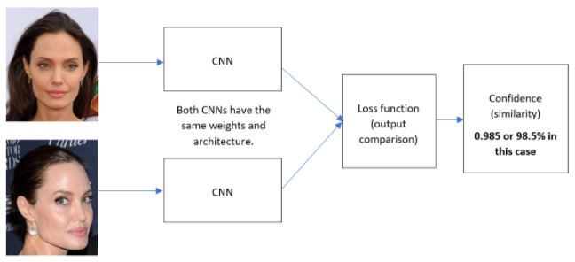

# Face-Verification-Model-using-CNNs
Face verification model using Siamese CNNs and One-Shot Learning.

To use this code, modify the inputs section in the Python or Google Colab files (whichever you prefer). 
The inputs are the following:
          
    - CNN architecture: Choose one of the following: 'LeNet5', 'AlexNet', 'VGG19', or 'GoogleNet'
    - Directory: Directory to the training set images. 
                 The directory must contain one folder per person. Each folder must include 4-5 images of that person.
                 Refer to the 'people' folder in this repository.
    - Test directory: Directory to the validation set images. 
                 The directory must include the images that you want to test. It should NOT contain folders. 
                 Refer to the 'test_images' folder in this repository.
    - Epochs: Number of training iterations (epochs) in TensorFlow.
    
 

